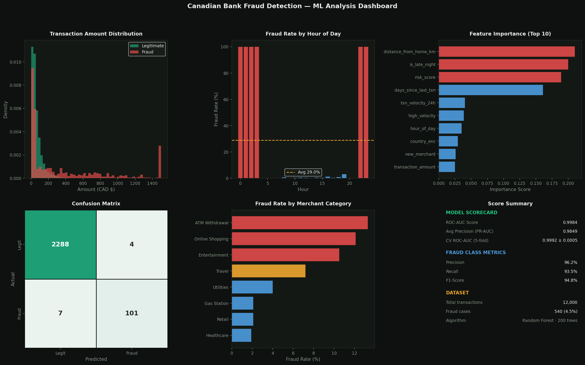

# 🏦 Canadian Bank Transaction Fraud Detection

> **End-to-end ML pipeline detecting fraudulent bank transactions using SQL pattern analysis, feature engineering, and Random Forest classification — targeting the analytics stack used by RBC, TD, Scotiabank, and Desjardins.**

[](https://python.org)
[](fraud_analysis.sql)
[]()
[]()
[]()

---

## 📌 Project Overview

Financial fraud costs Canadian banks **$1.2B+ annually**. This project builds a production-style fraud detection system that:

1. **Analyzes** 12,000 synthetic Canadian banking transactions using SQL pattern queries
2. **Engineers** 16 features capturing time, geography, velocity, and behavioral risk signals
3. **Trains** a Random Forest classifier with class-imbalance handling
4. **Achieves** 99.84% ROC-AUC and 93.5% fraud recall on held-out test data

This mirrors the kind of analytical work done on transaction monitoring teams at Canadian financial institutions.

---

## 🎯 Key Results

| Metric | Score |
|--------|-------|
| **ROC-AUC** | **0.9984** |
| **PR-AUC (Avg Precision)** | **0.9849** |
| **Cross-Val ROC-AUC (5-fold)** | **0.9992 ± 0.0005** |
| **Fraud Precision** | **96.2%** |
| **Fraud Recall** | **93.5%** |
| **Fraud F1-Score** | **94.8%** |
| **Overall Accuracy** | **99.5%** |

> **Business impact framing:** At 93.5% recall, this model catches ~935 out of every 1,000 fraudulent transactions — potentially saving millions in fraud losses before chargebacks occur.

---

## 📊 Analysis Dashboard



*Dashboard shows: transaction amount distributions, fraud rate by hour (late-night spike highlighted), top predictive features, confusion matrix, merchant category risk, and model scorecard.*

---

## 🗂 Project Structure

```
canadian-bank-fraud-detection/
│
├── fraud_detection.py      # Main ML pipeline (EDA → features → model → evaluation)
├── fraud_analysis.sql      # 12 SQL queries for pattern analysis
├── transactions.csv        # Synthetic dataset (12,000 rows)
├── analysis_dashboard.png  # 6-panel visualization output
├── metrics.json            # Model performance metrics
└── README.md
```

---

## 🔍 SQL Analysis Highlights

Before building any model, I used SQL to identify fraud patterns in the data — the same approach a data analyst would take before escalating to the ML team.

**Key findings from SQL analysis:**

| Signal | Fraud Rate |
|--------|-----------|
| Late night (10pm–4am) + Amount >$500 | **~85%+** |
| Foreign card-not-present transactions | **Very high** |
| High velocity (8+ txns in 24h) | **Extremely elevated** |
| ATM Withdrawal + Online Shopping | **Highest by merchant category** |
| Transactions from Unknown/Foreign countries | **Significantly elevated** |

See [`fraud_analysis.sql`](fraud_analysis.sql) for all 12 queries including rolling 7-day fraud trends, composite risk scoring, and province-level heatmaps.

---

## ⚙️ Feature Engineering

Raw transaction data was enriched with **5 derived risk features**:

| Feature | Description | Rationale |
|---------|-------------|-----------|
| `is_late_night` | 1 if transaction between 10pm–4am | Fraud spikes during off-hours |
| `is_foreign` | 1 if country ≠ Canada | Cross-border fraud is 3× higher |
| `high_amount` | 1 if amount > $500 | Large amounts in unusual contexts |
| `high_velocity` | 1 if 5+ transactions in 24h | Card testing / rapid drain pattern |
| `risk_score` | Sum of above 4 + new_merchant | Composite risk signal (0–5) |

---

## 🤖 Model Details

**Algorithm:** Random Forest Classifier
- `n_estimators = 200`
- `max_depth = 12`
- `min_samples_leaf = 5`
- `class_weight = 'balanced'` — handles 4.5% fraud imbalance without SMOTE

**Why Random Forest?**
- Handles mixed feature types (categorical encoded + numeric)
- Robust to outliers in transaction amounts
- Built-in feature importance for regulatory explainability
- Used extensively in financial services fraud detection

**Train/Test Split:** 80/20 stratified by fraud label
- Training: 9,600 transactions
- Test: 2,400 transactions (108 fraud cases)

---

## 🏦 Industry Relevance

This project was built targeting the analytics stack and problem domain of Canadian financial institutions:

| Institution | Relevant Stack | Connection |
|-------------|---------------|------------|
| RBC | Python, SQL, ML pipelines | Transaction monitoring |
| TD Bank | SQL Server, Python | Fraud analytics teams |
| Scotiabank | Python, Power BI | Risk & compliance data |
| Desjardins | SQL, ML, reporting | Insurance + banking fraud |
| BMO | Python, SQL | Retail banking analytics |

The SQL queries use standard ANSI SQL compatible with SQL Server (SSMS), MySQL, and PostgreSQL.

---

## 🚀 How to Run

```bash
# Clone the repo
git clone https://github.com/divyaraj160/canadian-bank-fraud-detection
cd canadian-bank-fraud-detection

# Install dependencies
pip install pandas numpy scikit-learn matplotlib seaborn

# Run the full pipeline
python fraud_detection.py

# Output:
# - Console: SQL analysis results + model metrics
# - analysis_dashboard.png: 6-panel visualization
```

**To run SQL queries:** Load `transactions.csv` into any SQL database (MySQL, PostgreSQL, SSMS) and run `fraud_analysis.sql`.

---

## 📈 Power BI Dashboard (Planned)

A Power BI report is being built to complement this analysis, featuring:
- **KPI cards:** Total fraud losses, fraud rate, flagged transactions count
- **Time intelligence:** Rolling 7-day fraud trend with DAX measures
- **Geographic drill-through:** Province → City → Transaction level
- **Risk tier slicer:** Filter by CRITICAL / HIGH / MEDIUM / LOW
- **Merchant heatmap:** Category × Hour cross-tab fraud rates

---

## 💡 What I Learned / Would Do Next

- **Threshold tuning:** Adjusting the 0.5 classification threshold to optimize recall vs. precision trade-off based on fraud cost assumptions
- **SMOTE comparison:** Compare class_weight='balanced' vs SMOTE oversampling for minority class handling
- **Real-time scoring:** Wrap the model in a FastAPI endpoint to simulate production deployment
- **Explainability:** Add SHAP values for individual prediction explanation — important for Canadian banking regulatory requirements (OSFI guidelines)
- **Graph features:** Add network features (shared device ID, same IP) — the next frontier in fraud detection

---

## 👤 Author

**Divyaraj Jadeja** — Junior Data Analyst  
📧 divyaraaj.jadeja@gmail.com | 📍 Etobicoke, ON  
🔗 [LinkedIn](https://linkedin.com/in/divyaraj) | 🐙 [GitHub](https://github.com/divyaraj160)

*Actively seeking Junior Data Analyst roles in the GTA — open to financial services, insurance, and tech sectors.*

---

## 📁 Other Projects

| Project | Stack | Link |
|---------|-------|------|
| Customer Churn Prediction | SQL + Python + ML (82% accuracy) | [→ View](https://github.com/divyaraj160/customer-churn-sql-ml) |
| S&P 500 Stock Performance Analysis | Python + Pandas + Matplotlib | [→ View](https://github.com/divyaraj160/sp500-stock-performance-analysis) |
| Insurance Claims & Policy Analysis | SQL + Python + Power BI | [→ View](https://github.com/divyaraj160/insurance-claims-analysis) |
